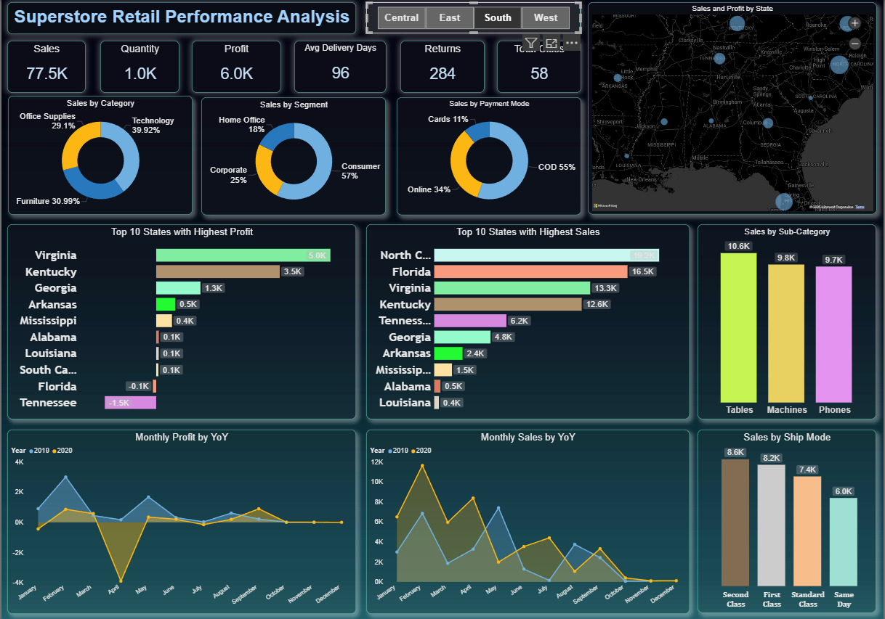

# 📊 Sales Analysis Dashboard

This repository contains a **Power BI Sales Analysis Dashboard** built using the **SuperStore Sales Dataset**.  
The dashboard provides insights into sales, profit, customer segments, and regional performance to support data-driven decision-making.

---

## 📂 Project Files
- **Sales_Analysis.pbix** → Power BI report file with interactive dashboards.  
- **SuperStore_Sales_Dataset.xlsx** → Dataset used for building the report.

---

## 🚀 Features & Insights
The dashboard includes:
- **Sales Overview**: Total Sales, Profit, and Quantity metrics.  
- **Category & Sub-Category Analysis**: Performance comparison across product lines.  
- **Geographical Insights**: Sales by region and state using maps.  
- **Customer Segment Analysis**: Sales & profit breakdown by Consumer, Corporate, and Home Office.  
- **Trend Analysis**: Monthly/Yearly sales and profit trends.  
- **Top & Bottom Performers**: Best and worst performing products and regions.

---

## 🛠️ Tools & Technologies
- **Power BI** → Data visualization and dashboard creation.  
- **Microsoft Excel** → Data source (SuperStore Sales dataset).  

---

## 📥 How to Use
1. Download the files from this repository:
   - `Sales_Analysis.pbix`
   - `SuperStore_Sales_Dataset.xlsx`
2. Open **Power BI Desktop**.  
3. Load the `Sales_Analysis.pbix` file.  
4. If needed, update the dataset source:
   - Go to **Home → Transform Data → Data Source Settings**  
   - Point to the location of `SuperStore_Sales_Dataset.xlsx`.

---

## 📊 Dashboard Preview
Here’s a preview of the Power BI dashboard interface:

> *(Replace `images/dashboard_preview.png` with the actual path to your exported screenshot)*  

---

## 📌 Future Enhancements
- Add forecasting models for future sales prediction.  
- Integrate real-time data sources.  
- Enhance customer segmentation using RFM analysis.  
